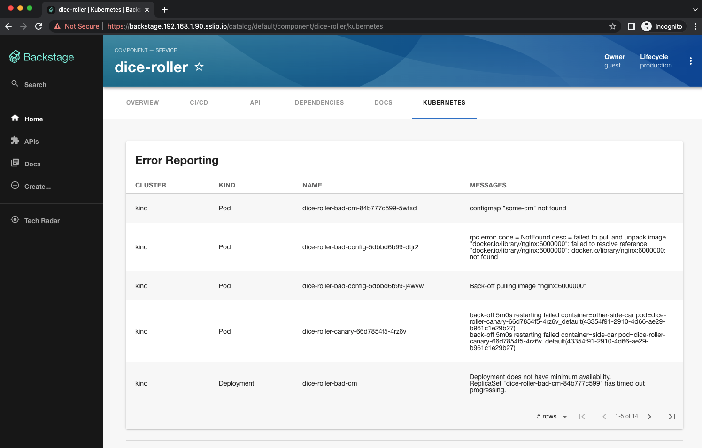

# Backstage

Table of Contents
=================

* [Prerequisites](#prerequisites)
* [Instructions](#instructions)
* [All-in-one](#all-in-one)
* [Plugins](#plugins)
  * [SqlLite DB](#sqllite-db)
  * [k8s](#k8s)
* [Cleanup](#cleanup)

## Prerequisites

- [Node.js](https://nodejs.org/en) (18 or 20)
- [nvm](https://github.com/nvm-sh/nvm), npm and [yarn](https://classic.yarnpkg.com/lang/en/docs/install/#mac-stable) installed
- [Docker](https://www.docker.com/products/docker-desktop/), [Helm](https://helm.sh/docs/intro/install/) and [Kind](https://kind.sigs.k8s.io/docs/user/quick-start/)
- Interesting read: https://john-tucker.medium.com/backstage-and-kubernetes-by-example-3b49725e8acb

## Instructions

Here are the steps to follow to install a customized backstage project on a k8s cluster using the plugins defined at the section: [plugins](#plugins)

Open a terminal and execute the following command within the folder where you want to launch backstage
```bash
npx @backstage/create-app
npx: installed 70 in 12.614s
? Enter a name for the app [required] my-backstage
...
🥇  Successfully created my-backstage

 All set! Now you might want to:
  Run the app: cd my-backstage && yarn dev
  Set up the software catalog: https://backstage.io/docs/features/software-catalog/configuration
  Add authentication: https://backstage.io/docs/auth/
```

Test it locally by launching this command and next access the UI at this address: `http://localhost:3000/`
```bash
yarn dev
```

**IMPORTANT**: To configure the different plugins, follow the instructions of the [plugins](#plugins) section before to move to the next step !

Build the image and upload it within your local registry (or kind cluster)
```bash
yarn build:all
yarn build-image -t backstage:dev
kind load docker-image backstage:dev
```

We can now create the Helm values file to expose the ingress route, use an `app-config` file using a configMap and 
use the image built
```bash
DOMAIN_NAME="<VM_IP>.nip.io"
cat <<EOF > $(pwd)/my-values.yml
ingress:
  enabled: true
  host: backstage.$DOMAIN_NAME
  className: nginx
serviceAccount:
  create: true  
backstage:
  image:
    pullPolicy: IfNotPresent
    registry: "docker.io/library"
    repository: "backstage"
    tag: "dev"
  extraAppConfig:
    - filename: app-config.local.yaml
      configMapRef: my-app-config         
EOF
```
and deploy it using helm
```bash
helm repo add bitnami https://charts.bitnami.com/bitnami
helm repo add backstage https://backstage.github.io/charts

helm upgrade --install \
  my-backstage \
  backstage/backstage \
  -f $(pwd)/my-values.yml \
  --create-namespace \
  -n backstage
```

We can now create our `app-config.local.yaml` backstage config file:
```bash
DOMAIN_NAME="<VM_IP>.nip.io"
cat <<EOF > $(pwd)/my-backstage/app-config.local.yaml
app:
  baseUrl: http://backstage.$DOMAIN_NAME
  title: Backstage
backend:
  baseUrl: http://backstage.$DOMAIN_NAME
  cors:
    origin: http://backstage.$DOMAIN_NAME
    methods: [GET, POST, PUT, DELETE]
    credentials: true      
  csp:
    connect-src: ['self','http:','https:']
  database:
    client: better-sqlite3
    connection: ':memory:'
  cache:
    store: memory
techdocs:
  builder: 'local' # Alternatives - 'external'
  generator:
    runIn: 'local' # Alternatives - 'local'
  publisher:
    type: 'local' # Alternatives - 'googleGcs' or 'awsS3'. Read documentation for using alternatives.
    
catalog:
  import:
    entityFilename: catalog-info.yaml
  rules:
    - allow: [ Component, System, API, Resource, Location ]
  locations:
    # Quarkus template, org, entity
    - type: url
      target: https://github.com/ch007m/my-backstage-templates/blob/main/all.yaml
      rules:
        - allow: [Template,Location,Component,System,Resource,User,Group]
EOF
```

Create the `configMap` containing our parameters and rollout the backstage app to reload its config
```bash
kubectl create configmap my-app-config -n backstage \
  --from-file=app-config.local.yaml=$(pwd)/app-config.local.yaml
  
kubectl rollout restart deployment/my-backstage -n backstage
```
Grab the URL of backstage and access it from your browser
```bash
BACKSTAGE_URL=$(kubectl get ingress/my-backstage -n backstage -o json | jq -r '.spec.rules[0].host')
echo "http://${BACKSTAGE_URL}"
```

## All-in-one

You can also install the project oin kind usign the bash script:
```bash
./script/install.sh -h
Usage: install.sh [OPTIONS]
Options:

[Global Mandatory Flags]
  --action: What action to take ?
    "deploy": Installing backstage
    "remove": Deleting backstage

[Global Optional Flags]
  -h or -help: Show this help menu

[Mandatory Flags - Used by the Instance/Delete Action]
  --ip-domain-name: VM IP and domain name (e.g 127.0.0.1.nip.io)
 
Example of command to be executed: 
./script/install.sh --action deploy --ip-domain-name 127.0.0.1.nip.io
```

## Plugins

### SqlLite DB

To use an in-memory database such as `sqlite3`, add the package of the sqlite3 DB.
```bash
cd my-backstage 
yarn add --cwd packages/backend better-sqlite3
```
and next update the `app-config.local.yaml` file to set the property:
```yaml
backend:
...
  database:
    client: better-sqlite3
    connection: ':memory:'
  cache:
    store: memory
```
### k8s

To use the backstage kubernetes plugin (front, backend), it is needed to install 2 packages with the project:
```bash
yarn add --cwd packages/app @backstage/plugin-kubernetes
yarn add --cwd packages/backend @backstage/plugin-kubernetes-backend
```

**Note**: If you create a new backstage project, then it is needed to update the files: `packages/app/src/components/catalog/EntityPage.tsx` and `packages/backend/src/plugins/kubernetes.ts` 
as described hereafter: https://backstage.io/docs/features/kubernetes/installation !

To allow backstage to access the k8s cluster resources, it is then needed to create a RBAC using this command:
```bash
cat <<EOF | kubectl apply -f -
apiVersion: rbac.authorization.k8s.io/v1
kind: ClusterRoleBinding
metadata:
  name: sa-admin
roleRef:
  kind: ClusterRole
  name: cluster-admin
  apiGroup: rbac.authorization.k8s.io
subjects:
  - kind: ServiceAccount
    name: backstage
    namespace: backstage
EOF
```
Next, the existing `ConfigMap` must be extended to include the kubernetes config

Since kubernetes >=1.24, it is needed to request to the kube controller to create a token for a secret. This is what wa will do hereafter for the backstage service account:
```bash
cat <<EOF | kubectl apply -f -
---
apiVersion: v1
kind: ServiceAccount
metadata:
  name: backstage
  namespace: backstage
---
kind: Secret
apiVersion: v1
metadata:
  annotations:
    kubernetes.io/service-account.name: "backstage"
  name: backstage
  namespace: backstage  
type: kubernetes.io/service-account-token
EOF
```
Next, we can grab the token from the secret and pass it to the configMap definition of the kubernetes client:
```bash
BACKSTAGE_SA_TOKEN=$(kubectl -n backstage get secret backstage -o=json | jq -r '.data["token"]' | base64 -d)
cat <<EOF >> $(pwd)/my-backstage/app-config.local.yaml
kubernetes:
  serviceLocatorMethod:
    type: 'multiTenant'
  clusterLocatorMethods:
  - type: 'config'
    clusters:
      - url: https://kubernetes.default.svc
        name: kind
        authProvider: 'serviceAccount'
        skipTLSVerify: true
        skipMetricsLookup: true
        serviceAccountToken: /var/run/secrets/kubernetes.io/serviceaccount/token
EOF

You can now create a configmap using the `app-config.local.yaml` file of the `my-backstage` project
```bash
kubectl create configmap my-app-config -n backstage \
  --from-file=app-config.local.yaml=$(pwd)/my-backstage/app-config.local.yaml \
  -o yaml \
  --dry-run=client | kubectl apply -n backstage -f -

kubectl rollout restart deployment/my-backstage -n backstage
```
Open now [backstage](https://backstage.127.0.0.1.nip.io/), select the [component](https://backstage.127.0.0.1.nip.io/catalog/default/component/my-quarkus) `my-quarkus` and click on the `kubernetes` tab, and you will see



## Cleanup

To uninstall the chart
```bash
helm uninstall my-backstage -n backstage
```